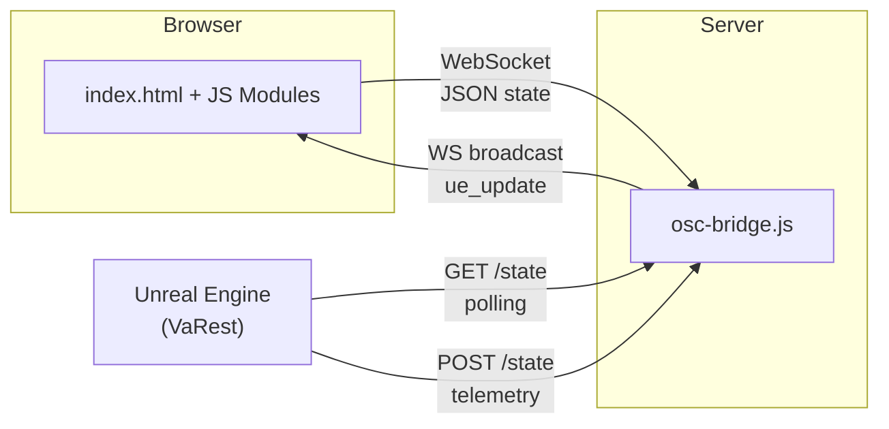
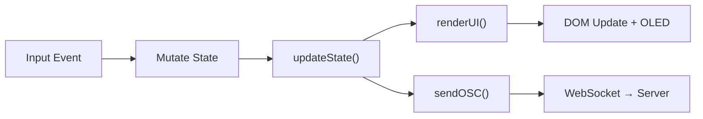
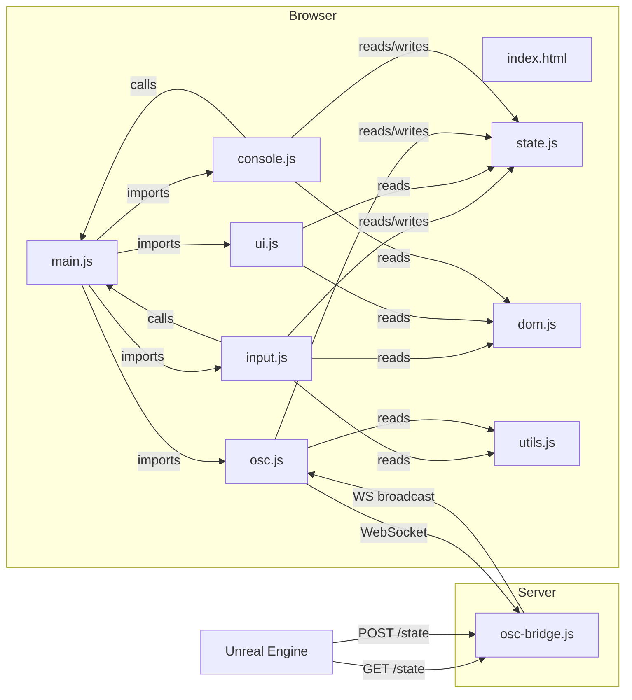

# OSC Deck — Architecture & Conventions

## Architecture



The browser pushes a flat JSON state object over WebSocket on every input change. Unreal polls `GET /state` to read the latest values and can POST telemetry back for OLED display.

## Data Flow



All rendering reads from state. No DOM reads during render. No state mutations during render.

## Module Dependency Graph



No circular imports exist. `main.js` owns `updateState()` which calls `renderUI()` + `sendOSC()`. Modules that need to trigger state updates import the function reference from `main.js`. `osc.js` has no DOM or UI dependencies — it receives a render callback via `connectOSC(onRender)`.

## Module Responsibilities

| File | Responsibility |
|------|---------------|
| `state.js` | Shared state, `DEFAULT_CAM_STATE`, per-camera factory, `KNOB_CONFIGS` / `SLIDER_V_CONFIGS` |
| `dom.js` | DOM element references (queried once at load, never re-queried) |
| `input.js` | All pointer event wiring (knobs, sliders, joystick, yaw, toggles, resets) |
| `ui.js` | Pure rendering: state → DOM visual updates + log panel rendering |
| `osc.js` | WebSocket client, payload construction, telemetry ingestion (no DOM deps) |
| `console.js` | Camera selector buttons + log panel toggle |
| `utils.js` | Pure math helpers: `clamp`, `fmt`, `fmtUnsigned`, `applyDeadzone` |
| `main.js` | Entry point, `updateState()` orchestrator, knob tick SVG generation, iOS touch hardening |

## Conventions

### Config-Driven Controls

All knobs and sliders are defined as config arrays in `state.js`:

```js
KNOB_CONFIGS = [
    { key: 'k1', label: 'SHUTTER', ueKey: 'shutter', zeroToOne: true, resetKey: 'resetShutter', steps: 5 },
    // ...
];
SLIDER_V_CONFIGS = [
    { key: 'sliderV', label: 'FCS', ueKey: 'fcs', zeroToOne: false, resetKey: 'resetFcs' },
    // ...
];
```

Adding a new control requires only a new config entry — zero logic changes.

### Single Source of Truth for Defaults

`DEFAULT_CAM_STATE` is a frozen template object that defines all per-camera defaults in one place. The `createCamState()` factory spreads from it, and all reset handlers reference it directly:

```js
const defaultVal = DEFAULT_CAM_STATE[config.key];
```

Never hardcode default values in event handlers. Always reference `DEFAULT_CAM_STATE`.

### Pointer Events + Multi-Touch

All controls use the Pointer Events API (`pointerdown`, `pointermove`, `pointerup`, `pointercancel`). Do not use `click` or `touchstart` — they introduce delay on mobile or break multi-touch.

An `activePointers` Map tags each pointer with a `zone` (inner, outer, yaw, knob, slider, sliderV) enabling simultaneous multi-touch interaction.

### Spring-Back vs Retained State

Movement axes (pan, tilt, pitch, roll, yaw, FCS, custom slider) snap to zero on release. Stateful controls (knobs, FCL, IRIS) retain their values. When adding new controls, decide which category they belong to and handle the release accordingly in `input.js`.

### Telemetry Callback Pattern

`connectOSC(onRender)` accepts a render callback, keeping the network layer free of UI/DOM imports. On UE telemetry updates, the callback triggers a re-render without any circular dependencies. Follow this pattern when adding new server-to-client communication.

### OLED Telemetry Fallback

When displaying values on the OLED, always prefer UE telemetry over the local state:

```js
globalState.activeValue = globalState.ueTelemetry[config.label] ?? localValue.toFixed(2);
```

This applies to all contexts: drag, pointerdown, and reset handlers.

### DOM Caching

All `getElementById` / `querySelector` calls execute once at module load via factory functions (`createKnob`, `createSliderV`) in `dom.js`. Never query the DOM at runtime. If a new element is added, register it in `dom.js` and import the reference.

### Error Handling

- **Server**: Use structured log prefixes — `[+]` for connections/success, `[-]` for disconnections, `[!]` for errors.
- **Client**: Use `console.warn` with a `[OSC]` prefix for WebSocket errors. Do not silently swallow errors with empty catch blocks.

## Server Architecture

A single-file Node.js server (`server/osc-bridge.js`) with one dependency (`ws`):

- **WebSocket**: Receives JSON state from browser, stores as `latestState`
- **GET /state**: Returns `latestState` as JSON array (Unreal polling)
- **POST /state**: Receives UE telemetry, broadcasts to all WS clients as `ue_update`
- **CORS**: Enabled for cross-origin access

## CSS Architecture

```
style.css (imports only)
├── tokens.css        Design tokens / variables
├── base.css          Reset + body styles
├── layout.css        Grid / spatial positioning
└── components/
    ├── joystick.css
    ├── console.css
    ├── knobs.css
    ├── slider.css
    ├── oled.css
    └── log.css
```

Design tokens are defined in `tokens.css` and referenced by component stylesheets. Each UI component has its own CSS file. Do not add inline styles in HTML or mix component styles across files.
