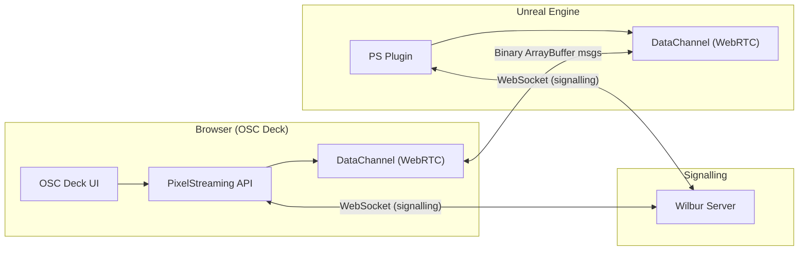
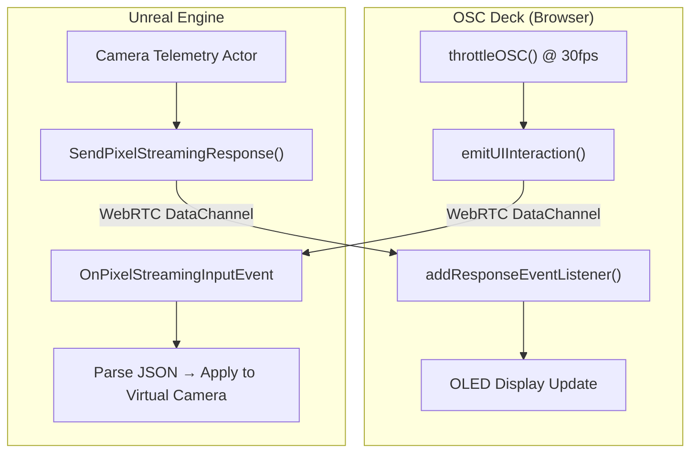

# PixelStreamingInfrastructure — Data Communication Study

## Architecture Overview

The repo is an **NPM Workspaces monorepo** providing everything needed to stream an Unreal Engine application to a web browser via WebRTC:



| Package | Role |
|---------|------|
| `Common/` | Shared protobuf messages, WebSocket transports, logging |
| `Signalling/` | Library for custom signalling servers |
| `SignallingWebServer/` | Reference signalling server "Wilbur" + HTTP server |
| `Frontend/library/` | **Core library** — WebRTC, video, input, **data channels** |
| `Frontend/ui-library/` | UI component library (CSS-in-JS) |
| `Frontend/implementations/` | Reference apps (TypeScript, React) |

---

## The Two Communication Channels

### 1. Browser → UE ("ToStreamer")

Messages are sent over the **WebRTC DataChannel** as binary `ArrayBuffer` payloads. Each message starts with a `uint8` message ID, followed by typed fields.

#### Built-in Message Types

| ID | Name | Structure | Purpose |
|----|------|-----------|---------|
| 0 | `IFrameRequest` | `[]` | Request keyframe |
| 1 | `RequestQualityControl` | `[]` | Take quality ownership |
| 6 | `LatencyTest` | `[string]` | Latency measurement |
| 7 | `RequestInitialSettings` | `[]` | Get UE encoder/WebRTC settings |
| **50** | **`UIInteraction`** | **`[string]`** | **🔑 Custom JSON data → UE** |
| **51** | **`Command`** | **`[string]`** | **🔑 Console/config commands → UE** |
| 52 | `TextboxEntry` | `[string]` | Send text to focused UE widget |
| 60–62 | Key events | `[uint8...]` | Keyboard input |
| 70–76 | Mouse events | `[uint8, uint16...]` | Mouse input |
| 80–82 | Touch events | `[uint8, uint16...]` | Touch input |
| 90–94 | Gamepad events | `[uint8...]` | Gamepad input |

> [!IMPORTANT]
> **`UIInteraction` (ID 50)** is the primary channel for sending **arbitrary custom data** from browser to UE. It accepts any JSON-serializable object. This is exactly what we need for OSC Deck payloads.

### 2. UE → Browser ("FromStreamer")

| ID | Name | Purpose |
|----|------|---------|
| 0 | `QualityControlOwnership` | Tells browser if it owns quality |
| **1** | **`Response`** | **🔑 Custom JSON string from UE → browser** |
| **2** | **`Command`** | **🔑 Structured command from UE (JSON)** |
| 3 | `FreezeFrame` | JPEG freeze frame image |
| 5 | `VideoEncoderAvgQP` | Video quality metric |
| 7 | `InitialSettings` | Encoder + WebRTC configuration |
| 12 | `InputControlOwnership` | Input control grant/revoke |
| 255 | `Protocol` | Dynamic protocol negotiation |

> [!IMPORTANT]
> **`Response` (ID 1)** is the primary channel for receiving **arbitrary data from UE**. UE sends UTF-16 encoded JSON strings, which arrive at `addResponseEventListener()` callbacks. This is how camera telemetry, scene data, etc. will feed the OLED display.

---

## Key API Methods for OSC Deck Integration

### Sending Data to UE

```javascript
// Primary method — sends any JSON object to UE over data channel
pixelStreaming.emitUIInteraction({
    type: "osc_deck",
    camera: "A",
    axis5: { tx: 0.45, ty: -0.12, tz: 0.78, ry: 0.33, rz: -0.55 },
    knobs: { shutter: -1, ei: 0, nd: 0, wb: 0, rate: 1, masterRate: 1 },
    sliders: { iris: 0.5, zoom: 0.3, focus: 0.8, custom: 0 },
    autofocus: true
});

// Alternate: send a UE command (for console commands)
pixelStreaming.emitCommand({ "ConsoleCommand": "stat fps" });
```

> [!NOTE]
> `emitUIInteraction()` internally calls `JSON.stringify()` on the descriptor, then sends it as a `string` field via message type `UIInteraction` (ID 50). On the UE side, this arrives at the Blueprint-exposed **`OnPixelStreamingInputEvent`** — all UE-side logic will be handled in Blueprints using the PS2 library.

### Receiving Data from UE

```javascript
// Register listener for UE → browser responses
pixelStreaming.addResponseEventListener("osc_deck_telemetry", (response) => {
    const data = JSON.parse(response);
    // data could contain: { cameraName: "A", focalLength: 35, tStop: 2.8, ... }
    updateOLEDDisplay(data);
});

// Register custom message handler for new/custom message types
pixelStreaming.registerMessageHandler(
    "CameraTelemetry",                    // message type name
    MessageDirection.FromStreamer,          // direction
    (data) => {                           // handler
        const text = new TextDecoder('utf-16').decode(data.slice(1));
        const telemetry = JSON.parse(text);
        updateOLEDDisplay(telemetry);
    }
);
```

### Connection Lifecycle

```javascript
const config = new Config({ useUrlParams: true });
const stream = new PixelStreaming(config);

stream.addEventListener('webRtcConnected', () => {
    console.log('Connected to UE — data channel ready');
});

stream.addEventListener('dataChannelOpen', ({ data }) => {
    console.log(`DataChannel "${data.label}" opened — can send/receive`);
});

stream.connect();
```

---

## Data Type Capabilities

The `SendMessageController` supports these wire types for custom message structures:

| Type | Bytes | JS Equivalent |
|------|-------|---------------|
| `uint8` | 1 | `number` (0–255) |
| `uint16` | 2 | `number` (0–65535) |
| `int16` | 2 | `number` (-32768–32767) |
| `float` | 4 | `number` (32-bit float) |
| `double` | 8 | `number` (64-bit float) |
| `string` | 2+2n | `string` (UTF-16 encoded) |

> [!TIP]
> For OSC Deck data, the simplest approach is using `emitUIInteraction()` which sends everything as a JSON string. For performance-critical paths (30fps updates), you could register a custom binary `ToStreamer` message with `float` fields to avoid JSON serialization overhead.

---

## OSC Deck ↔ UE Data Mapping

### Current OSC Deck State ([state.js](file:///c:/Users/CaesarProM/Documents/OSC_Deck/js/state.js))

```javascript
{
    tx, ty, tz, ry, rz,           // 5-axis joystick (floats × rate × masterRate)
    k1, k2, k3, k4, k5, k6,      // Knobs: Shutter, EI, ND, WB, Rate, MasterRate
    slider, sliderV, sliderV2, sliderV3, // IRIS, Zoom, Focus, Custom
    afOn                           // Autofocus toggle (boolean)
}
```

### Current OSC Output ([osc.js](file:///c:/Users/CaesarProM/Documents/OSC_Deck/js/osc.js))

Currently logs to console at ~30fps:
```
/cam/A/5axis [tx, ty, tz, ry, rz]
/cam/A/knobs [k1, k2, k3, k4, k5, k6]
/cam/A/sliders [iris, zoom, focus, custom]
/cam/A/af [0|1]
```

### Proposed Integration Strategy



#### Browser → UE (OSC Deck Controls)

Replace the current `ws.send` log in `osc.js` with:

```javascript
pixelStreaming.emitUIInteraction({
    cam: globalState.activeCam,
    axis: [tx, ty, tz, ry, rz],
    knobs: [k1, k2, k3, k4, k5, k6],
    sliders: [s1, s2, s3, s4],
    af: afOn ? 1 : 0
});
```

#### UE → Browser (OLED Telemetry)

```javascript
pixelStreaming.addResponseEventListener("oled_feed", (response) => {
    const d = JSON.parse(response);
    // d = { focalLength: 35, tStop: 2.8, iso: 800, wb: 5600, recording: true, tc: "01:23:45:12", ... }
    updateOLED(d);
});
```

On the UE side (Blueprint only):
```
• "Bind Event to OnPixelStreamingInputEvent" — receive OSC Deck JSON payloads
• "Send Pixel Streaming Response" node — push telemetry JSON back to browser
• All parsing and camera control logic handled in Blueprint graphs
```

---

## Key Files Reference

| File | Purpose |
|------|---------|
| [PixelStreaming.ts](file:///c:/Users/CaesarProM/Documents/OSC_Deck/PS2/PixelStreamingInfrastructure/Frontend/library/src/PixelStreaming/PixelStreaming.ts) | Main public API class — `emitUIInteraction()`, `addResponseEventListener()`, `registerMessageHandler()` |
| [StreamMessageController.ts](file:///c:/Users/CaesarProM/Documents/OSC_Deck/PS2/PixelStreamingInfrastructure/Frontend/library/src/UeInstanceMessage/StreamMessageController.ts) | Message protocol definitions (all ToStreamer/FromStreamer message types) |
| [SendMessageController.ts](file:///c:/Users/CaesarProM/Documents/OSC_Deck/PS2/PixelStreamingInfrastructure/Frontend/library/src/UeInstanceMessage/SendMessageController.ts) | Binary serialization of outgoing messages |
| [ResponseController.ts](file:///c:/Users/CaesarProM/Documents/OSC_Deck/PS2/PixelStreamingInfrastructure/Frontend/library/src/UeInstanceMessage/ResponseController.ts) | Handler for UE→Browser response messages (UTF-16 JSON) |
| [DataChannelController.ts](file:///c:/Users/CaesarProM/Documents/OSC_Deck/PS2/PixelStreamingInfrastructure/Frontend/library/src/DataChannel/DataChannelController.ts) | WebRTC DataChannel lifecycle management |
| [WebRtcPlayerController.ts](file:///c:/Users/CaesarProM/Documents/OSC_Deck/PS2/PixelStreamingInfrastructure/Frontend/library/src/WebRtcPlayer/WebRtcPlayerController.ts) | Core controller — wires all message handlers, implements `emitUIInteraction()` |
| [EventEmitter.ts](file:///c:/Users/CaesarProM/Documents/OSC_Deck/PS2/PixelStreamingInfrastructure/Frontend/library/src/Util/EventEmitter.ts) | All event types (30+ events for lifecycle, data, stats) |

---

## Summary

| Direction | Primary API | Data Format | Our Use Case |
|-----------|------------|-------------|--------------|
| **OSC Deck → UE** | `emitUIInteraction(obj)` | JSON string over DataChannel | Send camera controls (5axis, knobs, sliders, AF) at 30fps |
| **UE → OSC Deck** | `addResponseEventListener(name, cb)` | JSON string from UE | Receive camera telemetry for OLED display |
| **Custom binary** | `registerMessageHandler()` | Typed binary fields | Optional: high-perf binary protocol for 30fps updates |

> [!TIP]
> **Both protocols will be tested:**
> - **JSON path** — `emitUIInteraction()` / `addResponseEventListener()` — simplest, human-readable, easy to debug in Blueprints.
> - **Custom binary path** — `registerMessageHandler()` with typed `float`/`uint8` fields — lower latency, less GC, ideal for 30fps streaming.
>
> The PixelStreaming library supports **dynamic protocol extension** — UE can send a `Protocol` message (ID 255) at runtime to register new custom message types with specific binary structures. This enables defining an optimized wire format for the 5-axis + knobs + sliders payload without JSON serialization overhead.
